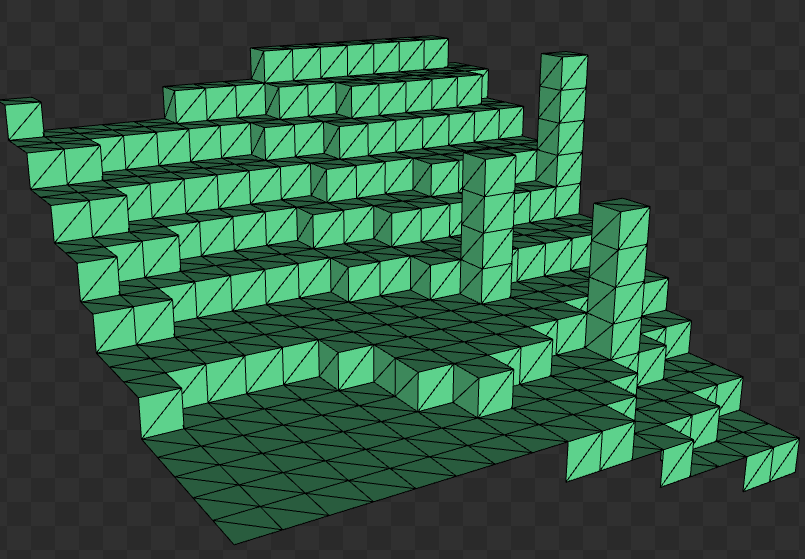

# Craftmine

A small Minecraft-like demo written in C++ using OpenGL. This demo was inspired by [TheCherno/Architecture](https://github.com/TheCherno/Architecture) project.


## Build

This project uses CMake to generate project files. Use the following commands to create a build directory and generate project files for your specific build system. This will also pull all the necessary build dependencies (GLFW, GLAD, GLM, FreeType).

Before cloning the project, make sure that your system supports *OpenGL 4.6*.

```
mkdir build
cd build
cmake ..
```

NOTE: To build GLAD you might need to install Python Jinja2 package.

## About This Demo

This is the first time I've made something serious in C++ and OpenGL (more serious than just a rotating cube :D). I used some guidance from ChatGPT to better understand concepts related the game development, like world generation, object picking, culling, lighting, etc., and will highlight some of them below.

### World Organization & Generation 

This demo uses a simple 16x16-block chunks concept (256 blocks in height) and stores chunks in an unordered map using chunk's X & Y position as the map key.

```cpp
std::unordered_map<glm::ivec2, std::shared_ptr<Chunk>, ivec2_hash> chunks;

class Chunk {
    ...
    BlockType[16][256][16] blockTypes; // air, stone, grass, dirt
};
```

Terrain and decorations (trees) are generated using [Perlin](https://en.wikipedia.org/wiki/Perlin_noise) noise.

### Culling

To avoid rendering each individual block, the demo uses frustum culling to render only visible chunks.

As part of the rendering optimization, mesh batching is implemented for each chunk. This ensures that only visible surfaces are rendered. Mesh batching runs in a separate thread because it is a very expensive operation.



### Lighting

This demo uses ambient occlusion and follows a concept described in [this post](https://0fps.net/2013/07/03/ambient-occlusion-for-minecraft-like-worlds/). 

This demo also features day/night cycle, shifting the ambient colors between two states and considering the sun position in the fragment shader.


### Object Picking

Visible blocks are cached for each chunk to perform object picking and object placement. A simple ray-casting and AABB intersection techinique is used—first on chunks (sorted by distance from the camera) and then on the visible blocks.


